<p align="center">
  
</p>

<p align="center">
  <strong>Enterprise startup directory submission and distribution platform.</strong>
</p>

<p align="center">
  <a href="https://lighthouse-8b66.onrender.com"></a>
  <a href="https://github.com/DaCameraGirl/lighthouse"></a>
</p>

<p align="center">
  
  
</p>

### Languages

<p align="center">
  
  
</p>

### Stack

<p align="center">
  
  
</p>

<p align="center">
  Built by <strong>Angela Hudson</strong> · <a href="https://github.com/DaCameraGirl">DaCameraGirl</a>
</p>
# Lighthouse

**Enterprise startup directory submission & distribution platform.**

**Live:** [lighthouse-8b66.onrender.com](https://lighthouse-8b66.onrender.com) — demo login `demo@lighthouse.app` / `demo12345`. (Free tier: the first request after idle can take ~50s to wake.)

Lighthouse gets a startup listed across the directories, launch boards, and review
sites that actually drive discovery — then tracks the backlinks, referring domains,
and traffic that result. It is the in-house, multi-tenant alternative to outsourced
"submit my startup to 200+ directories" services: you own the data, the automation,
and the analytics.

> Working name. Rename lives in one place: `packages/core/src/brand.ts`.

---

<p align="center"></p>
<p align="center"></p>


Outsourced submission services are a maintained directory list plus human labor,
sold behind unverifiable traffic claims. Lighthouse turns that into software:

- A **curated directory catalog** carrying the metadata that matters — domain
  authority, pricing, category, approval signals, and an *automation class* that
  says whether a directory can be filled by a bot or needs a human in the loop.
- A **submission engine** that is tiered, not all-or-nothing: automation-friendly
  directories are handled by a resilient worker fleet; captcha/login-gated ones are
  routed to a semi-automatic cockpit where the operator pastes pre-filled, AI-tailored
  copy in seconds.
- **Analytics** that close the loop: which listings went live, what backlinks landed,
  and how referring domains trend over time.

<p align="center"></p>
<p align="center"></p>


A monorepo of independently scalable tiers:

| Workspace | Stack | Responsibility |
|-----------|-------|----------------|
| `apps/web` | Vite + TypeScript | Press-kit studio, directory explorer, submission cockpit, analytics dashboards |
| `apps/api` | Fastify + Prisma + Postgres | Multi-tenant orgs & auth, press kits, directory catalog, submission records, REST API |
| `apps/worker` | Playwright + BullMQ/Redis | Automation fleet — fills automation-friendly directories with retry/backoff and screenshot proof |
| `packages/directories` | Curated dataset + loader | The asset: vetted directories with full metadata |
| `packages/core` | Shared TypeScript types | Single source of truth across every tier |

```
            ┌──────────────┐      REST       ┌──────────────┐
  Operator ─▶   apps/web    ├────────────────▶   apps/api    │
            └──────────────┘                 └──────┬───────┘
                                                    │ enqueue
                                            ┌───────▼───────┐
                                            │  Redis queue  │
                                            └───────┬───────┘
                                            ┌───────▼───────┐
                                            │  apps/worker  │ ─▶ directory sites
                                            │  (Playwright) │     (+ screenshot proof)
                                            └───────────────┘
```

<p align="center"></p>
<p align="center"></p>


| Class | Meaning | Handled by |
|-------|---------|------------|
| `auto` | No captcha, no login, stable form | Worker fleet (fully automated) |
| `assisted` | Login or light friction | Cockpit (pre-filled, one human click) |
| `manual` | Captcha / review / paid gate | Cockpit (operator submits, tracks status) |

<p align="center"></p>
<p align="center"></p>


Lighthouse uses **PostgreSQL** in every environment (dev/prod parity). No local
database install is required — point `DATABASE_URL` at a hosted Postgres (e.g.
your Render database's *External* connection string).

```bash
npm install
cp .env.example .env         # set DATABASE_URL to your Postgres; fill ANTHROPIC_API_KEY for AI copy
npm run db:migrate:deploy -w @lighthouse/api   # apply the schema
npm run db:seed -w @lighthouse/api             # demo workspace: demo@lighthouse.app / demo12345
npm run dev                  # all tiers in watch mode
```

Web cockpit: http://localhost:5173 · API: http://localhost:4000

> Windows desktop shortcut: `GameIcons\Launch-Lighthouse.ps1` starts the API +
> cockpit and opens the browser. It checks that `.env` has a real `DATABASE_URL`
> first.

<p align="center"></p>
<p align="center"></p>


The repo ships a [`render.yaml`](./render.yaml) Blueprint: one web service (the
Fastify API serving the built cockpit at the same origin) plus a managed
Postgres database.

1. In Render, **New → Blueprint** and pick this repo. It reads `render.yaml`.
2. Set `ANTHROPIC_API_KEY` in the dashboard (optional — AI copy tailoring).
   `DATABASE_URL` and `JWT_SECRET` are wired automatically.
3. Deploy. The build applies migrations and seeds the demo workspace, so the
   live site has a working `demo@lighthouse.app / demo12345` login immediately.

The cockpit talks to the API with relative `/api` paths, so in production both
are served from one origin — no CORS or API-URL configuration needed. Render's
free Postgres is removed ~30 days after creation; move the database and service
to a paid plan for an always-on deployment.

<p align="center"></p>
<p align="center"></p>


Foundation shipped. Built incrementally, PR by PR — see the tracking issue.

<p align="center"></p>
<p align="center"></p>


Licensed under the **Apache License 2.0** — see [LICENSE](./LICENSE) and
[NOTICE](./NOTICE). You're free to use, modify, and build on Lighthouse,
including commercially. In return, keep the `NOTICE` file and its attribution
to **Angela Hudson (DaCameraGirl)** with any copies or derivative works.

© 2026 Angela Hudson (DaCameraGirl).